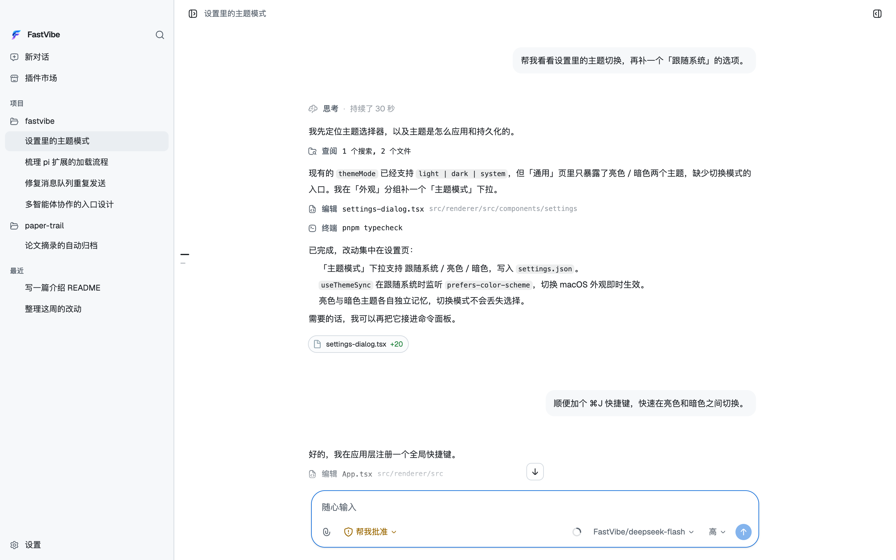
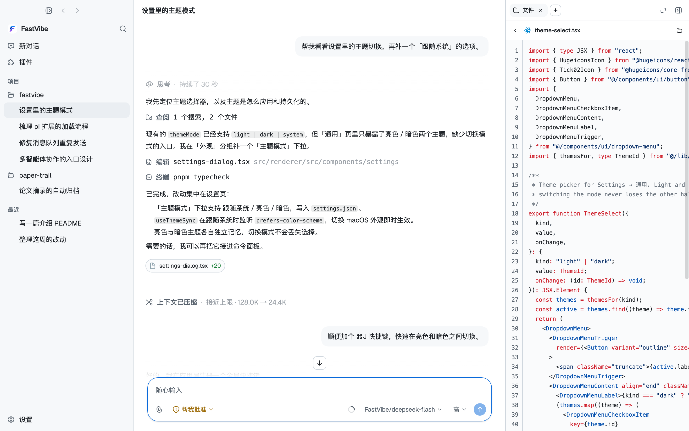
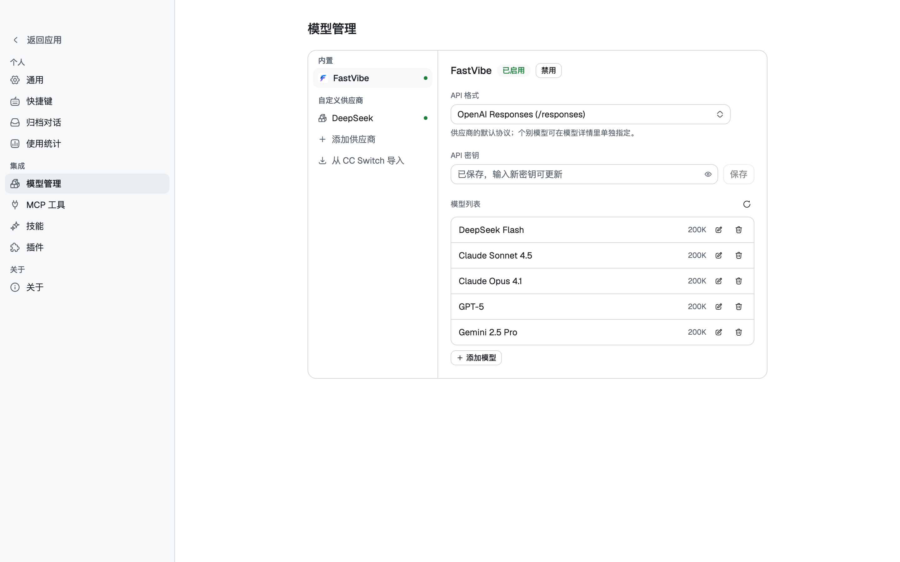

# FastVibe

[中文 README](README.zh-CN.md) · [English README](README.md)

[](LICENSE)
[](https://www.electronjs.org/)
[](https://github.com/badlogic/pi-mono)
[](https://github.com/tyuan511/fastvibe/releases/latest)

> A desktop AI agent workspace built on **pi coding agent**.
> FastVibe embeds the `@earendil-works/pi-coding-agent` SDK and supports the pi extension model.

FastVibe is an Electron desktop client for agent work. Instead of reimplementing an agent runtime,
it runs pi directly in the main process and presents terminal interactions—tool calls, reasoning,
extension dialogs, plan mode, and goal mode—as a native GUI.



## Download

The links below always open the **latest GitHub release**. Choose the installer for your platform:

- [macOS — download the `.dmg` or `.zip`](https://github.com/tyuan511/fastvibe/releases/latest)
- [Windows — download the `.exe` installer](https://github.com/tyuan511/fastvibe/releases/latest)
- [Linux — download the `.AppImage` or `.deb`](https://github.com/tyuan511/fastvibe/releases/latest)

GitHub's `releases/latest` redirect is intentional: it follows the newest published release without
putting a version number in this README. macOS builds are currently unsigned. If macOS quarantines
the app after it has been moved to Applications, run:

```bash
xattr -cr /Applications/FastVibe.app
```

## Highlights

- **The real pi runtime**: sessions, messages, tool calls, and extensions come from the pi SDK.
- **Pi extensions**: install packages from the pi ecosystem and bridge their commands, tools, and UI to the desktop.
- **Multi-project workspace**: group conversations by project, pin or archive them, and keep unbound chats in an isolated scratch workspace.
- **Tool-call visualization**: grouped reads/searches/lists, inline edit diffs, and terminal output with the original command.
- **Three permission modes**: ask, smart approval, and full access.
- **Plan and goal modes**: use `/plan` for read-only exploration and `/goal` for long-running work with progress tracking.
- **Flexible models**: use FastVibe or any OpenAI-compatible provider, with configurable protocols and model parameters.
- **MCP and skills**: manage stdio or Streamable HTTP MCP servers and `SKILL.md`-based skills from Settings.
- **Usage statistics**: view request and token usage by day, including usage from deleted sessions.
- **Workspace side panes**: file tree and preview, terminal, browser, Git review, and auxiliary conversations.
- **Browser use**: the agent can open pages, inspect snapshots, click, type, and submit forms in the built-in browser.
- **Git and attachments**: create or switch branches, attach images and files, queue messages, and retry or edit from a conversation branch.
- **20 themes**: independently select light and dark themes and scale the interface globally.
- **Automatic updates**: check for updates in the background and download/install them from the app.

## Relationship with pi

FastVibe's core promise is simple: **what a pi extension can do in the terminal, it can do here too**.

The engine is `@earendil-works/pi-coding-agent` and is started with `createAgentSession`. Its
`agentDir`, `sessionManager`, and `settingsManager` all point to FastVibe's isolated data directory,
not the user's native `~/.pi` directory.

Pi's UI context is bridged into the GUI:

| pi API | FastVibe UI |
| --- | --- |
| `ctx.ui.confirm` | Inline approval panel above the composer |
| `ctx.ui.select` / `input` / `questions` | Inline selection, input, and paginated question forms |
| `ctx.ui.editor` | Multiline prefilled dialog |
| `ctx.ui.notify` | Toast notification |
| `ctx.ui.setStatus` / `setWidget` | Status row and composer widgets |
| `ctx.ui.set_editor_text` | Composer prefill |
| `ctx.newSession` / `switchSession` | Create or switch conversations |

Extensions run in `mode: "rpc"`. Text and read-only pi-tui renderers are supported, with ANSI colors
mapped to the active theme. Extensions are installed through the SDK package manager into FastVibe's
isolated runtime and never write to `~/.pi`.

> **Known limitation:** `ctx.ui.custom()` is not supported. Full-screen interactive pi-tui components,
> raw keyboard/mouse events, and custom overlays are not simulated in the GUI. Use `select`, `confirm`,
> `input`, `editor`, or `questions` instead. `registerShortcut`, `registerEntryRenderer`, and several
> other terminal-only APIs are also not yet bridged; see the Chinese README for the full compatibility list.

## Built-in extensions

The application includes these extensions without a separate install:

- `plan.ts` — `/plan` mode with read-only tools and structured clarification questions.
- `goal.ts` — `/goal` long-running execution with pause, resume, and progress controls.
- `todo.ts` — a persistent todo tool shown above the composer while work is in progress.
- `session-title.ts` — generates a title from the first user prompt unless renamed manually.
- `browser-use.ts` — nine `browser_*` tools for the built-in browser.
- `permission-sandbox.ts` — classifies network access, unsafe paths, and destructive commands.

## Browser use

The Browser side pane is a real Electron `webview` with its own persistent partition. The agent
operates the same visible tabs through `browser_open`, `browser_snapshot`, `browser_click`,
`browser_type`, `browser_press`, and related tools. The workflow is snapshot-driven: take a snapshot,
address an element by its explicit reference or selector, perform an action, and snapshot again.



Browser automation is subject to the permission sandbox. The built-in browser can also import cookies
from supported Chromium browsers into FastVibe's isolated browser partition; passwords and payment
data are not copied.

## Model management

FastVibe is one provider among many, not an onboarding gate. Configure a provider, fetch its model
list, and select the models to keep. Protocols can be set at provider level or overridden per model.
Context windows, output limits, input modalities, reasoning levels, and prices come from the bundled
models.dev snapshot, which can be refreshed from Settings → About.



## Development

Requirements: **Node.js 24** and **pnpm 11**. macOS, Windows, and Linux are supported.

```bash
pnpm install
pnpm dev          # sync the models.dev snapshot and start electron-vite
```

Other useful commands:

```bash
pnpm typecheck    # type-check the main and renderer processes
pnpm sync:models  # regenerate the models.dev snapshot
pnpm build        # build to out/
pnpm dist:mac     # package macOS (dist:win and dist:linux are also available)
```

`src/renderer/mock.html` provides a browser preview without Electron:

```bash
pnpm exec vite src/renderer --config vite.config.ts   # /mock.html?theme=dark
```

## Data and privacy

All runtime data is stored in FastVibe's own userData directory. Native `~/.pi` data is never read or
written. Provider credentials stay in FastVibe's isolated runtime and are injected into the SDK's
in-memory authentication storage; they are not exported to the user's login shell or the in-app terminal.

| Platform | Data directory |
| --- | --- |
| macOS | `~/Library/Application Support/FastVibe/` |
| Windows | `%APPDATA%\\FastVibe\\` |
| Linux | `~/.config/FastVibe/` |

The runtime contains settings, the conversation catalog, provider configuration, logs, browser
partitions, session transcripts, skills, the SDK model registry, reasoning timings, a usage ledger,
and isolated worktrees/scratch directories.

## Project structure

```text
src/main/          Electron main process: window, IPC, and embedded agent lifecycle
  engine/          Isolated runtime paths, provider configuration, models, and file helpers
  pi/              Embedded pi host, MCP bridge, and multi-session lifecycle
src/preload/       contextBridge API (window.fastvibe)
src/renderer/      React UI (Vite)
src/shared/        IPC channels and shared types
resources/extensions/  Built-in pi extensions
resources/skills/      Built-in pi skills
```

## License

[MIT](LICENSE) © 2026 FastVibe
