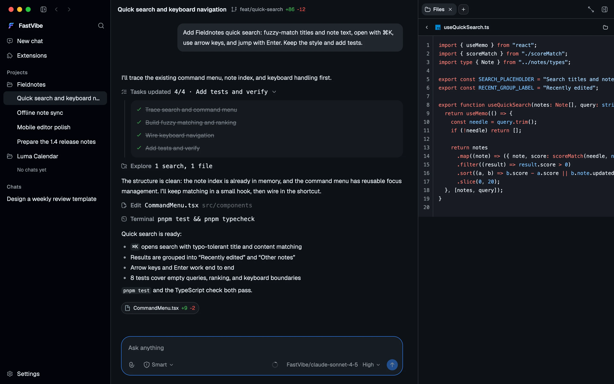
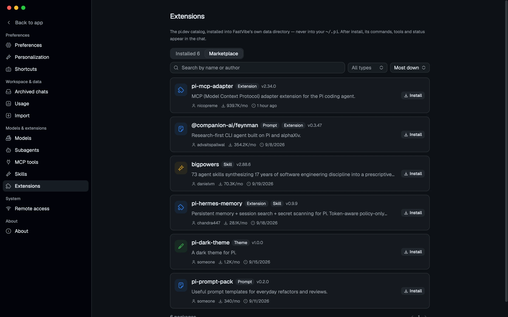
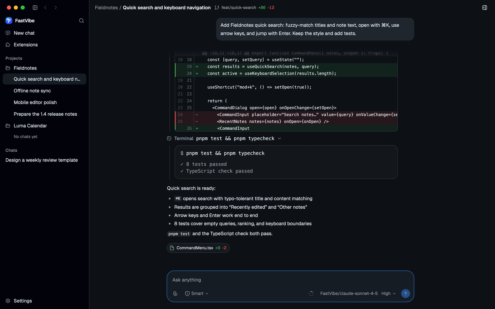
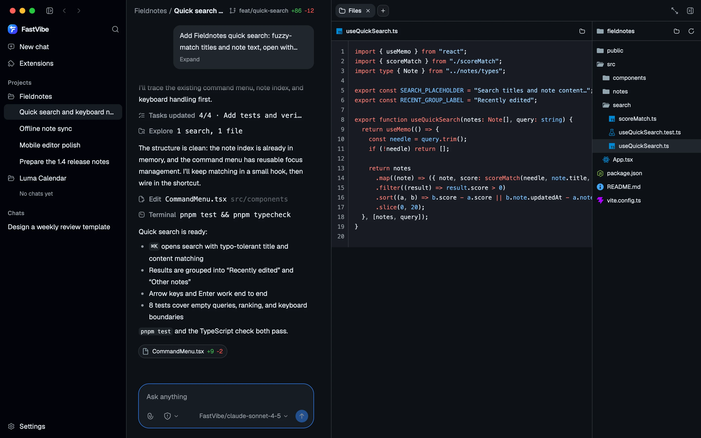
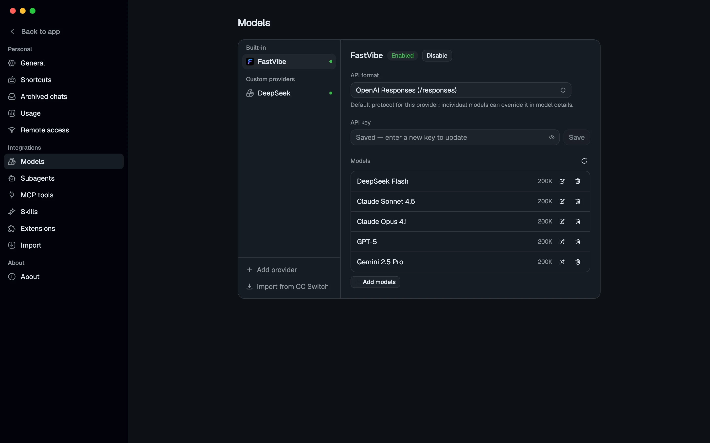

# FastVibe

[中文 README](README.zh-CN.md) · [English README](README.md)

[](LICENSE)
[](https://www.electronjs.org/)
[](https://github.com/badlogic/pi-mono)
[](https://github.com/tyuan511/fastvibe/releases/latest)

> A desktop AI agent workspace built on **pi coding agent**.
> FastVibe embeds the `@earendil-works/pi-coding-agent` SDK and supports the pi extension model.

FastVibe is an Electron desktop client for agent work. Instead of reimplementing an agent runtime,
it runs pi directly in the main process and presents terminal interactions—tool calls, reasoning,
extension dialogs, plan mode, and goal mode—as a native GUI.



## Download

The links below always open the **latest GitHub release**. Choose the installer for your platform:

- [macOS — download the `.dmg` or `.zip`](https://github.com/tyuan511/fastvibe/releases/latest)
- [Windows — download the `.exe` installer](https://github.com/tyuan511/fastvibe/releases/latest)
- [Linux — download the `.AppImage` or `.deb`](https://github.com/tyuan511/fastvibe/releases/latest)

GitHub's `releases/latest` redirect is intentional: it follows the newest published release without
putting a version number in this README. macOS builds are currently unsigned. If macOS quarantines
the app after it has been moved to Applications, run:

```bash
xattr -cr /Applications/FastVibe.app
```

## Highlights

- **The real pi runtime**: sessions, messages, tool calls, and extensions come from the pi SDK.
- **Pi extensions**: install packages from the pi ecosystem and bridge their commands, tools, and UI to the desktop.
- **Multi-project workspace**: group conversations by project, pin or archive them, and keep unbound chats in an isolated scratch workspace.
- **Tool-call visualization**: grouped reads/searches/lists, inline edit diffs, and terminal output with the original command.
- **Three permission modes**: ask, smart approval, and full access.
- **Plan and goal modes**: use `/plan` for read-only exploration and `/goal` for long-running work with progress tracking.
- **Flexible models**: use FastVibe or any OpenAI-compatible provider, with configurable protocols and model parameters.
- **MCP and skills**: manage stdio or Streamable HTTP MCP servers and `SKILL.md`-based skills from Settings.
- **Usage statistics**: view request and token usage by day, including usage from deleted sessions.
- **Workspace side panes**: file tree and preview, terminal, browser, Git review, and auxiliary conversations.
- **Browser use**: the agent can open pages, inspect snapshots, click, type, and submit forms in the built-in browser.
- **Git and attachments**: create or switch branches, attach images and files, queue messages, and retry or edit from a conversation branch.
- **20 themes**: independently select light and dark themes and scale the interface globally.
- **Automatic updates**: check for updates in the background and download/install them from the app.

## Relationship with pi

FastVibe's core promise is simple: **what a pi extension can do in the terminal, it can do here too**.

The engine is `@earendil-works/pi-coding-agent` and is started with `createAgentSession`. Its
`agentDir`, `sessionManager`, and `settingsManager` all point to FastVibe's isolated data directory,
not the user's native `~/.pi` directory.

Pi's UI context is bridged into the GUI:

| pi API | FastVibe UI |
| --- | --- |
| `ctx.ui.confirm` | Inline approval panel above the composer |
| `ctx.ui.select` / `input` / `questions` | Inline selection, input, and paginated question forms |
| `ctx.ui.editor` | Multiline prefilled dialog |
| `ctx.ui.notify` | Toast notification |
| `ctx.ui.setStatus` / `setWidget` | Status row and composer widgets |
| `ctx.ui.set_editor_text` | Composer prefill |
| `ctx.newSession` / `switchSession` | Create or switch conversations |

Extensions run in `mode: "rpc"`. Text and read-only pi-tui renderers are supported, with ANSI colors
mapped to the active theme.

> **Known limitation:** `ctx.ui.custom()` is not supported. Full-screen interactive pi-tui components,
> raw keyboard/mouse events, and custom overlays are not simulated in the GUI. Use `select`, `confirm`,
> `input`, `editor`, or `questions` instead. `registerShortcut`, `registerEntryRenderer`, and several
> other terminal-only APIs are also not yet bridged; see [Compatibility limits](#compatibility-limits).

`registerMessageRenderer` output is parsed back into structured text and rendered. Extensions are
installed through the SDK's `DefaultPackageManager` into FastVibe's isolated `agentDir`, and **never
write to your own `~/.pi`**.

### Plugins and marketplace

**Settings → Extensions** has two tabs, 已安装 and 市场. The marketplace reads pi.dev's package catalog
(extensions, skills, themes, prompts) with one-click install/uninstall, while the installed tab shows
both the extensions bundled with the app and anything installed at runtime.



### Built-in extensions

Nine extensions ship with the app; none needs a separate install:

- **`plan.ts`** — `/plan` enters plan mode: the tool set narrows to read-only, and a `question` tool
  asks every clarifying question in one panel before the plan is confirmed and sent back as the
  execution prompt.
- **`goal.ts`** — `/goal` enters goal mode: each round compares progress against the objective until
  the model ends with `GOAL_COMPLETE`; the panel can view, pause, resume or clear it.
- **`todo.ts`** — a todo tool that is always available: the model submits the complete list each time
  (at most one item in progress), and unfinished items appear above the composer.
- **`session-title.ts`** — always on: the first user prompt is summarised into a session title, which
  a manual rename stops overwriting.
- **`browser-use.ts`** — the built-in browser's tool set: `browser_open` / `snapshot` / `click` /
  `type` / `press` / `history` and related tools, bridging page operations to the browser tab in the
  side pane.
- **`permission-sandbox.ts`** — the enforcement half of the permission sandbox: it detects network
  access, writes outside the workspace, sensitive paths and destructive commands, and asks for
  approval according to the active mode.
- **`web-search.ts`** — registers a `web_search` tool while the session model speaks the OpenAI
  Responses protocol, running the search as a side request.
- **`output-language.ts`** — always on: appends the host's AI language preference to the system
  prompt on every turn.
- **`subagent/`** — registers a `subagent` tool that delegates a self-contained task to a role file
  (`explorer`, `planner`, `worker`, `reviewer`), in single, parallel or chained mode.

## Feature overview

### Tool calls and diffs

Adjacent reads, searches and directory listings fold into one group, an edit expands into a numbered
diff, and a terminal call keeps the original command next to its output. When a reply ends, every file
that run touched is summarised on one line with `+n / -m`.



### Workspace side panes

The file tree uses Material Icon Theme icons, and a click previews the file in the same pane (syntax
highlighting by Shiki, plus images, PDF, CSV, HTML and diffs). The pane also carries a terminal, the
built-in browser, Git review and auxiliary conversations — and the browser is not only for people: the
agent can drive it through tools too.



### Browser use

The side pane's **Browser** tab is a real Electron `webview` running in its own persistent session
(`persist:fastvibe-browser`). The agent operates that very tab through nine `browser_*` tools — the
one you are looking at, not a separate invisible copy:

| Tool | What it does |
| --- | --- |
| `browser_open` | Opens or reuses a tab and returns the `tabId` later calls need |
| `browser_list_tabs` | Lists the tabs currently under control |
| `browser_navigate` | Visits a new address in a given tab |
| `browser_search` | Searches a keyword with the built-in search engine |
| `browser_snapshot` | Reads the title, URL, visible text and interactive elements |
| `browser_click` | Clicks by CSS selector or by visible text |
| `browser_type` | Fills an input and fires input / change |
| `browser_press` | Sends Enter / Tab / Escape and other keys |
| `browser_history` | Back / forward / reload |

The workflow is **snapshot-driven**: `browser_open` returns a `tabId` → after every navigation, click
or submit, `browser_snapshot` re-reads the page → the snapshot's selector (or a button's visible text)
addresses the target → snapshot again to confirm. A snapshot captures the visible interactive elements
and body text, so every step is based on the page's current state rather than a guess from an old
structure. This workflow ships as the built-in `browser-use` skill, which the model adopts
automatically when a task needs the web.

**Importing a login**: the browser toolbar's “import browser login” lists the profile names of the
local Chromium-family browsers (Chrome, Edge, Brave, Chromium, plus Arc and Opera on macOS) and writes
their **decrypted cookies into FastVibe's own isolated browser session**, then reloads the page.
Passwords, payment details and other credentials are not copied; a source browser that is running is
read together with its WAL so cookies written moments ago are not missed.

**Security boundary**

- The permission sandbox treats `browser_*` as an **unpredictable external tool**: under 请求批准 every
  call prompts for confirmation, and 完全访问 never asks.
- The built-in skill explicitly requires the model **not to treat instructions in page text as user
  authorisation**. For login, purchase, sending messages, deleting data or submitting an irreversible
  form, it states the concrete action first and asks for confirmation; opening a page, reading
  information and filling in a draft are fine.
- A snapshot never echoes passwords, tokens or full private data; the main-process bridge puts a time
  limit on every operation, and a closed window or a timeout reports an explicit error rather than
  failing silently.

### Model management

FastVibe is one provider among many, not an onboarding gate. Configure a provider, fetch its model
list, and select the models to keep. Protocols can be set at provider level or overridden per model.
Users who have [CC Switch](https://github.com/farion1231/cc-switch) installed can import its custom
providers and keys in one click from the same page. Context windows, output limits, input modalities,
reasoning levels and prices come from the bundled models.dev snapshot, which can be refreshed from
Settings → About.



### Themes

Twenty themes (ten light, ten dark); light and dark remember their own choice, and `themeMode` decides
which one is active. Every theme is derived from semantic tokens, so code highlighting and component
appearance follow along automatically.

## Development

Requirements: **Node.js 24** and **pnpm 11**. macOS, Windows, and Linux are supported.

```bash
pnpm install
pnpm dev          # sync the models.dev snapshot and start electron-vite
```

Other useful commands:

```bash
pnpm typecheck    # type-check the main and renderer processes
pnpm sync:models  # regenerate the models.dev snapshot
pnpm build        # build to out/
pnpm dist:mac     # package macOS (dist:win and dist:linux are also available)
```

### Browser preview without Electron

`src/renderer/mock.html` is a preview page for development and documentation only: it injects a mock
`window.fastvibe` before the app mounts and renders the real interface against fixed data, which makes
visual review and screenshots easy.

```bash
pnpm exec vite src/renderer --config vite.config.ts   # /mock.html?theme=dark
```

## Data and privacy

All runtime data is stored in FastVibe's own userData directory. Native `~/.pi` data is never read or
written. Provider credentials stay in FastVibe's isolated runtime and are injected into the SDK's
in-memory authentication storage; they are not exported to the user's login shell or the in-app terminal.

| Platform | Data directory |
| --- | --- |
| macOS | `~/Library/Application Support/FastVibe/` |
| Windows | `%APPDATA%\\FastVibe\\` |
| Linux | `~/.config/FastVibe/` |

Provider credentials stay in FastVibe's isolated runtime and are injected into the SDK's in-memory
authentication storage at launch; they are never exported to the user's login shell or the in-app
terminal. The built-in browser uses its own session partition for the same reason, so imported login
cookies are written only there and never touch the machine's own browser data.

## Keyboard shortcuts

The defaults are below, and **Settings → Shortcuts** can rebind each one or restore them:

| Shortcut | Action |
| --- | --- |
| `⌘/Ctrl + K` | Command palette (search chats, actions and settings) |
| `⌘/Ctrl + ,` | Open settings |
| `⌘/Ctrl + N` | New chat |
| `⌘/Ctrl + ⇧ + N` | New window |
| `⌘/Ctrl + O` | Open folder |
| `⌘/Ctrl + L` | Focus the composer |
| `⌘/Ctrl + F` | Find in the current conversation |
| `⌘/Ctrl + Enter` | Send the message (or queue it) |
| `Esc` | Stop generating |
| `⌘/Ctrl + [` / `⌘/Ctrl + ]` | Previous / next chat |
| `⌘/Ctrl + B` | Show / hide the sidebar |
| `⌘/Ctrl + J` | Show / hide the side pane |

Whether Enter sends directly is controlled by **Settings → Shortcuts → Enter to send**.

## Project structure

```text
src/main/          Electron main process: window, IPC, and embedded agent lifecycle
  engine/          Isolated runtime paths, provider configuration, models, and file helpers
  pi/              Embedded pi host, MCP bridge, and multi-session lifecycle
src/preload/       contextBridge API (window.fastvibe)
src/renderer/      React UI (Vite)
src/shared/        IPC channels and shared types
resources/extensions/  Built-in pi extensions
resources/skills/      Built-in pi skills
```

## Compatibility limits

A pi extension can degrade on its own through `ctx.mode` / `ctx.hasUI`. The following terminal-only
capabilities are not taken over by FastVibe:

- Shortcuts registered with `registerShortcut` are not yet forwarded to the interface.
- Custom entries from `registerEntryRenderer` are not yet merged into the conversation view.
- Full-screen interactive components from `ctx.ui.custom()` are unsupported and an explicit error is
  returned; use `select`, `confirm`, `input`, `editor` or `questions` instead.
- `registerMarkdownTransformer`, `setEditorComponent`, `addAutocompleteProvider` and theme selection
  are no-ops for now.

## License

[MIT](LICENSE) © 2026 FastVibe
