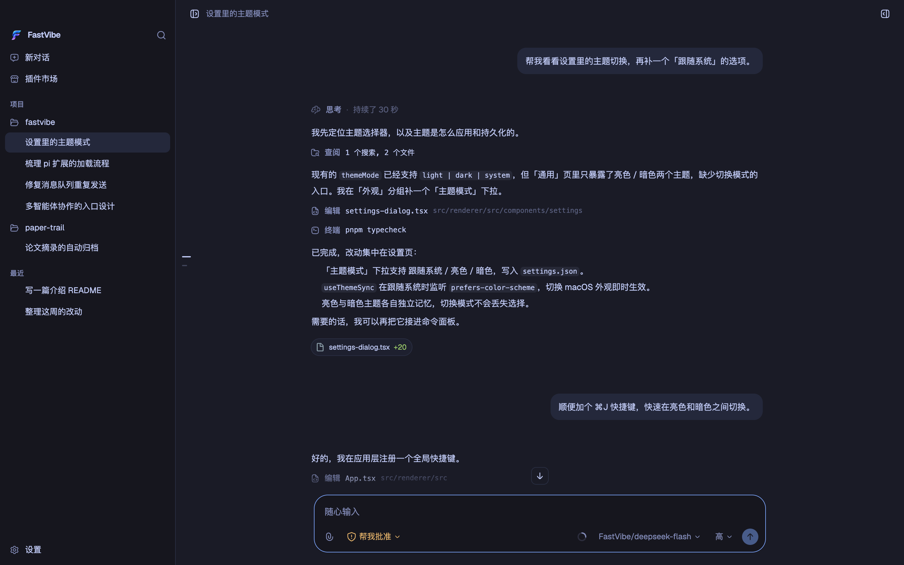
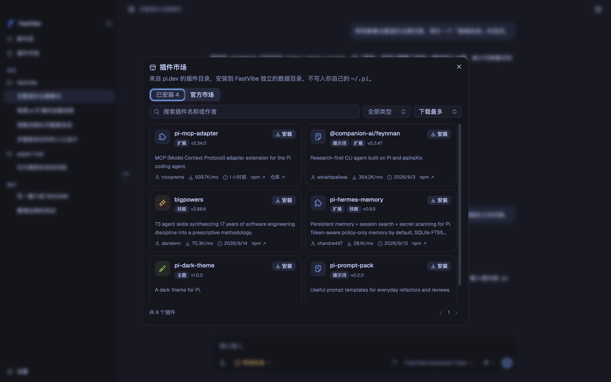
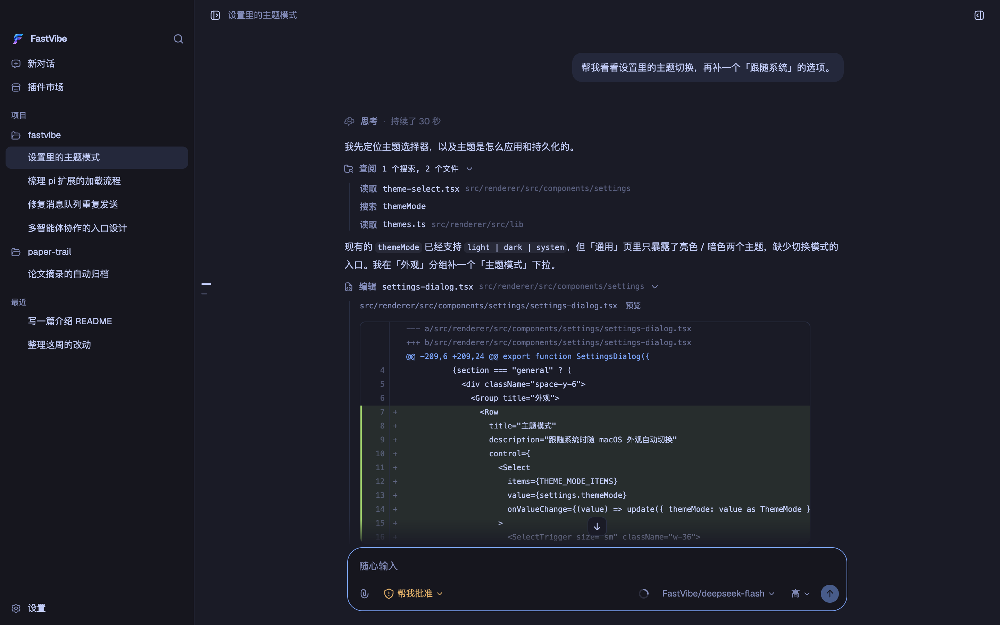
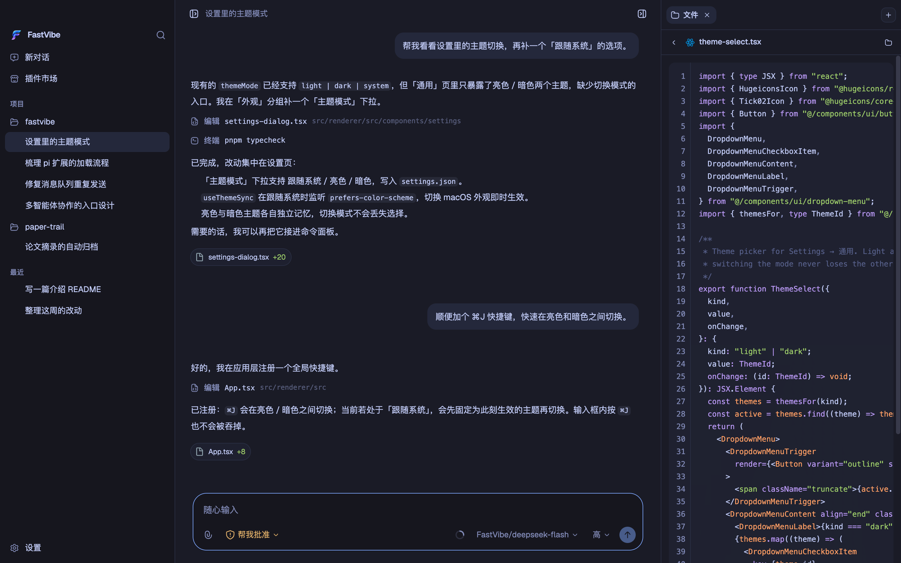
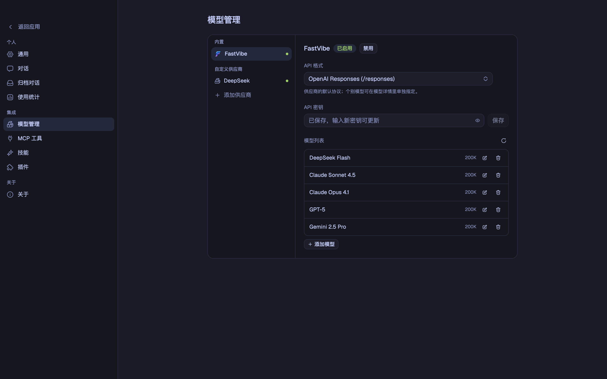

# FastVibe

> 基于 **pi coding agent** 构建的桌面智能体工作台：代码、办公与多智能体协作。
> 内嵌 `@earendil-works/pi-coding-agent` SDK，**100% 兼容 pi 插件机制**。

FastVibe 是一个 Electron 桌面客户端。它没有另起炉灶重写一套 Agent 内核，而是把
pi（pi coding agent）作为默认引擎直接跑在主进程里，再把原本只存在于终端里的交互
（工具调用、思考过程、扩展对话框、计划 / 目标模式……）原生地呈现为 GUI。

| 亮色 | 暗色 |
| --- | --- |
|  |  |

## 特性

- **真正的 pi，而不是仿制品**：会话、消息、工具调用、扩展都来自 pi SDK，行为与终端版一致。
- **100% 兼容 pi 插件机制**：pi 包可直接安装运行，命令、工具、UI 上下文全部生效。
- **多项目工作区**：侧边栏按项目分组会话，未绑定项目的对话自动落在隔离的 scratch 工作区。
- **工具调用可视化**：读取 / 搜索 / 列表归组，编辑展示 diff，终端展示 `$ command` 与输出。
- **权限沙箱三档**：`请求批准` / `帮我批准` / `完全访问权限`，由内置扩展在每次工具调用时判定。
- **计划模式与目标模式**：先只读探索再给方案；目标模式驱动长周期执行并在面板中查看进度。
- **模型随你选**：内置 FastVibe（默认 OpenAI Responses 协议），也可接入任意 OpenAI 兼容供应商。
- **并行运行**：同一条提示词最多交给 5 个模型，可选 git worktree 隔离后对比结果。
- **内置工作区侧栏**：文件树与预览、终端（xterm + node-pty）、浏览器、Git 审查、辅助对话。
- **20 套主题**：亮色 / 暗色各自独立选择，支持跟随系统。

## 与 pi 的关系

FastVibe 的核心承诺是：**pi 扩展在终端里能做什么，在这里就能做什么。**

- 引擎是 `@earendil-works/pi-coding-agent`，通过 `createAgentSession` 编程式启动；
  `agentDir`、`sessionManager`、`settingsManager` 全部指向 FastVibe 自己的目录。
- 扩展以 `mode: "rpc"` 绑定（而非默认的 `print`），所以依赖 TUI 的插件不会拒绝运行。
- pi 的 UI 上下文被逐一桥接到 GUI：

  | pi 扩展 API | FastVibe 呈现 |
  | --- | --- |
  | `ctx.ui.confirm` | 输入框上方的内联批准面板 |
  | `ctx.ui.select` / `input` / `questions` | 内联选择、输入与分页多问题表单 |
  | `ctx.ui.editor` | 多行预填对话框 |
  | `ctx.ui.notify` | 右下角通知 |
  | `ctx.ui.setStatus` / `setWidget` | 状态行与输入框上方组件（字符串或 pi-tui 组件） |
  | `ctx.ui.set_editor_text` | 输入框预填 |
  | `ctx.newSession` / `switchSession` | 基于会话目录创建 / 切换会话 |

- `registerMessageRenderer` 产出的 pi-tui 组件会被解析回结构化文本并渲染，
  ANSI 颜色映射到当前主题。
- 插件安装走 SDK 的 `DefaultPackageManager`，写入隔离的 `agentDir`，
  **不写入你自己的 `~/.pi`**。

### 插件市场

内置「插件市场」直接读取 pi.dev 的包目录，一键安装 / 卸载：



### 内置扩展

随应用内置三个扩展，无需安装：

- **`plan.ts`** —— `/plan` 进入计划模式：工具收窄为只读集合，可通过 `question`
  工具一次性提出多个澄清问题，确认后把方案作为执行提示词发回。
- **`goal.ts`** —— `/goal` 进入目标模式：每轮回溯目标、推进任务，直到模型以
  `GOAL_COMPLETE` 结束；面板可查看 / 暂停 / 继续 / 清除。
- **`permission-sandbox.ts`** —— 权限沙箱的执行侧：识别网络、工作区外写入、
  敏感路径与破坏性命令，并按模式决定是否请求批准。

## 功能一览

### 工具调用与 diff

读取 / 搜索 / 列目录相邻调用自动折叠成一组，编辑展开为行号 diff，终端保留原始命令与输出。
每条回复结束时，本轮改动过的文件会以带 `+n / -m` 的标签行汇总。



### 工作区侧栏

文件树使用 Material Icon Theme 图标，点击即在同一面板中预览（代码高亮由 shikiji 提供；
同时支持图片、PDF、CSV、HTML 与 diff）。侧栏还包含终端、内置浏览器、Git 审查与辅助对话。



### 模型管理

FastVibe 是众多供应商之一，而非强制的入门门槛。配置供应商后拉取其 `/models` 列表，
选择要保留的模型；协议可在供应商级设置默认值，也可在模型详情里单独指定。
上下文窗口、最大输出、输入模态、推理档位与价格来自内置的 models.dev 快照。



### 主题

二十套主题（十亮十暗），亮色与暗色分别记忆选择，`themeMode` 决定当前生效的一套。
每个主题都由语义 token 派生，代码高亮与组件外观自动跟随。

## 安装与开发

需要 Node.js 与 pnpm。

```bash
pnpm install
pnpm dev          # 同步 models.dev 快照后启动 electron-vite
```

其它常用命令：

```bash
pnpm typecheck    # 主进程 + 渲染进程类型检查
pnpm sync:models  # 重新生成 models.dev 快照
pnpm build        # 构建到 out/
pnpm dist:mac     # 打包 macOS（win / linux 同理）
```

### 界面预览（无 Electron）

`src/renderer/mock.html` 是一个仅用于开发与文档的浏览器预览页：它会在应用挂载前
注入一份 mock 的 `window.fastvibe`，用固定数据渲染真实界面，便于视觉走查与截图。

```bash
pnpm exec vite src/renderer --config vite.config.ts   # 访问 /mock.html?theme=dark
```

## 数据与隐私

所有运行数据都保存在应用自己的 userData 目录，**不读写原生 `~/.pi`**：

```
~/Library/Application Support/FastVibe/
  settings.json        界面偏好（主题、对话行为）
  conversations.json   会话目录
  providers.json       供应商与模型
  mcp.json             MCP 服务器
  runtime/engine/
    agent/sessions     会话记录
    wt                 隔离对话使用的 git worktree
    scratch            未绑定项目的对话工作区
```

供应商密钥保存在 FastVibe 的隔离运行时中，并在启动时注入 SDK 的内存认证存储，
不会导出到用户的登录 shell 或应用内终端。

## 快捷键

| 快捷键 | 作用 |
| --- | --- |
| `⌘/Ctrl + K` | 打开会话切换器 |
| `⌘/Ctrl + ⇧ + N` | 新开窗口 |
| `⌘/Ctrl + Enter` | 发送消息 |
| `⌃ + ⌥ + B` | 显示 / 隐藏侧边面板 |
| `Esc` | 停止当前运行 |

## 目录结构

```
src/main/          Electron 主进程：窗口、IPC 与内嵌 Agent 生命周期
  engine/          隔离运行时路径、供应商配置、模型与文件辅助
  pi/              内嵌 pi-coding-agent 宿主、MCP 桥接、多会话管理
src/preload/       contextBridge API（window.fastvibe）
src/renderer/      React 界面（Vite）
src/shared/        主进程与渲染进程共用的 IPC 通道与类型
resources/extensions/  随应用内置的 pi 扩展
```

## 兼容性边界

pi 扩展能通过 `ctx.mode` / `ctx.hasUI` 自行降级，以下纯终端能力仍在补齐中：

- `registerShortcut` 注册的快捷键尚未转发到界面。
- `registerEntryRenderer` 的自定义条目暂未合并进会话视图。
- `ctx.ui.custom()` 的全屏交互组件仍返回 `undefined`。
- `registerMarkdownTransformer`、`setEditorComponent`、`addAutocompleteProvider`、主题选择暂为空实现。

## 许可

暂未开源许可证。
