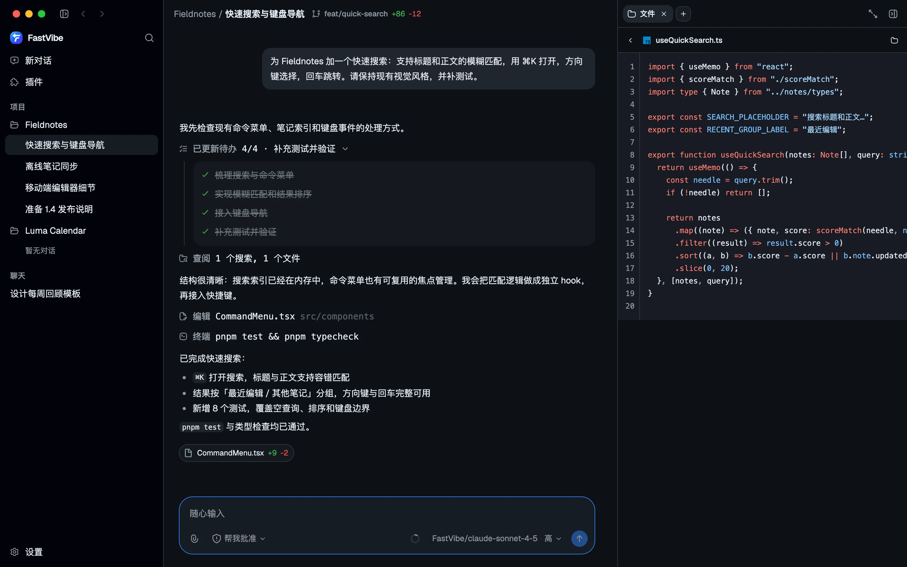
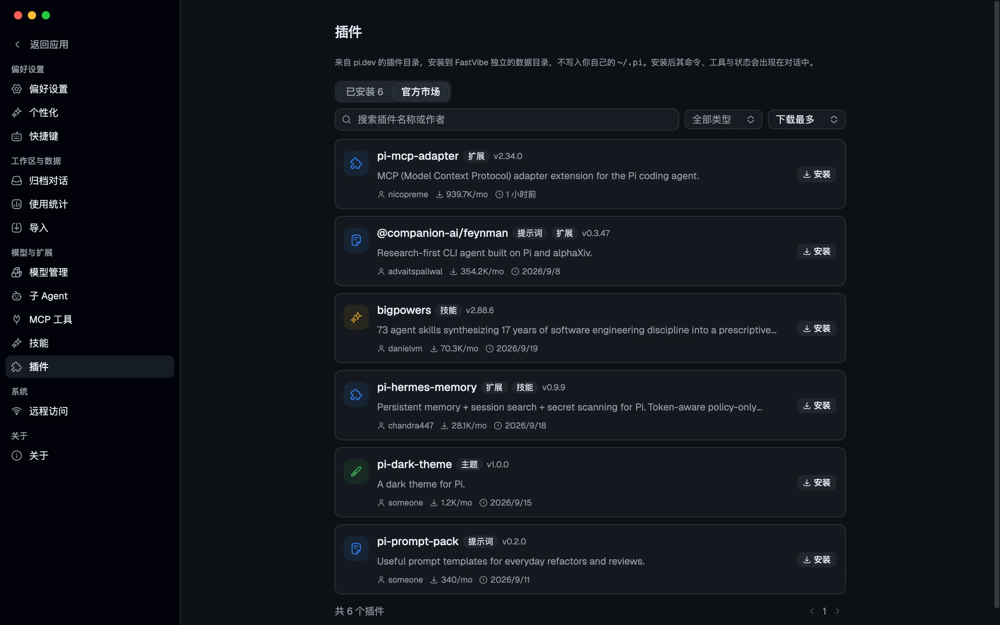
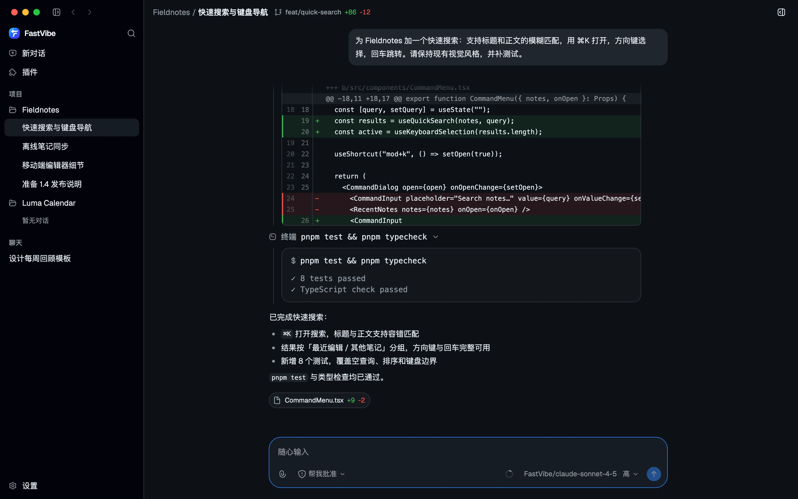
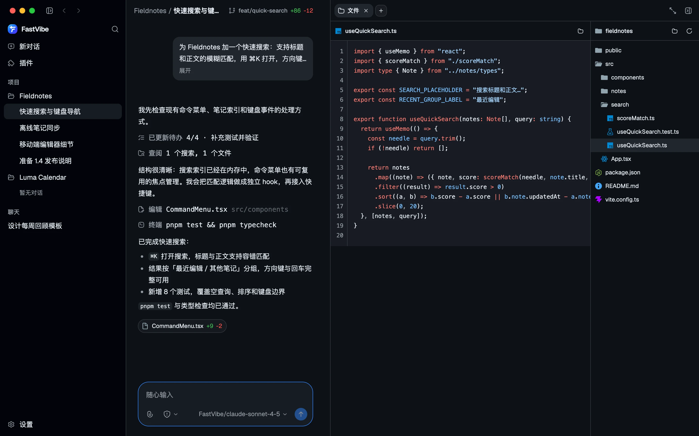
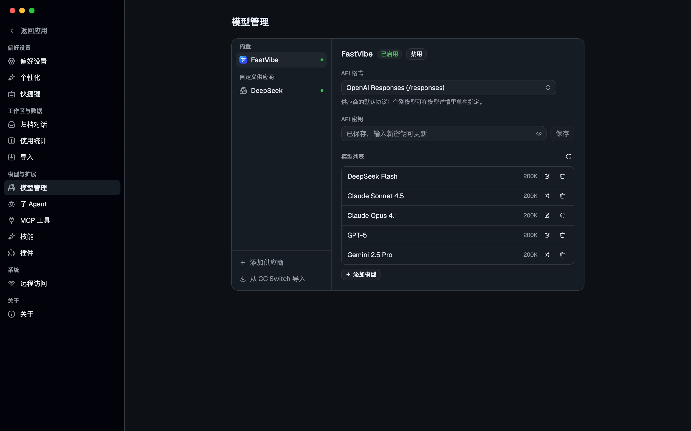

# FastVibe

[English README](README.md) · [中文 README](README.zh-CN.md)

[](LICENSE)
[](https://www.electronjs.org/)
[](https://github.com/badlogic/pi-mono)
[](https://github.com/tyuan511/fastvibe/releases/latest)

> 基于 **pi coding agent** 构建的桌面智能体工作台。
> 内嵌 `@earendil-works/pi-coding-agent` SDK，兼容 pi 插件机制。

FastVibe 是一个 Electron 桌面客户端。它没有另起炉灶重写一套 Agent 内核，而是把
pi（pi coding agent）作为默认引擎直接跑在主进程里，再把原本只存在于终端里的交互
（工具调用、思考过程、扩展对话框、计划 / 目标模式……）原生地呈现为 GUI。



## 下载

以下链接始终打开 **GitHub 最新 release**，请选择对应平台的安装包：

- [macOS — 下载 `.dmg` 或 `.zip`](https://github.com/tyuan511/fastvibe/releases/latest)
- [Windows — 下载 `.exe` 安装程序](https://github.com/tyuan511/fastvibe/releases/latest)
- [Linux — 下载 `.AppImage` 或 `.deb`](https://github.com/tyuan511/fastvibe/releases/latest)

这里使用 GitHub 的 `releases/latest` 重定向，因此无需在 README 中写死版本号。

## 特性

- **真正的 pi，而不是仿制品**：会话、消息、工具调用、扩展都来自 pi SDK，行为与终端版一致。
- **兼容 pi 插件机制**：pi 包可从官方市场安装运行，命令、工具、UI 上下文桥接到 GUI。
- **多项目工作区**：侧边栏按项目分组会话，支持置顶与归档；未绑定项目的对话落在隔离的 scratch 工作区。
- **工具调用可视化**：读取 / 搜索 / 列表归组，编辑展示 diff，终端展示 `$ command` 与输出。
- **权限沙箱三档**：`请求批准` / `帮我批准` / `完全访问`，由内置扩展在每次工具调用时判定。
- **计划模式与目标模式**：`/plan` 先只读探索再给方案；`/goal` 驱动长周期执行，可在面板中查看进度。
- **模型随你选**：内置 FastVibe（默认 OpenAI Responses 协议），也可接入任意 OpenAI 兼容供应商。
- **MCP 与技能**：stdio / Streamable HTTP MCP 服务器在设置里增删启停；技能以 `SKILL.md` 管理，可新建或从文件夹导入。
- **使用统计**：按日汇总请求与 Token，删除会话后仍能从 ledger 还原用量。
- **工作区侧栏**：文件树与预览、终端、浏览器、Git 审查、辅助对话。
- **内置浏览器（browser use）**：模型通过 `browser_*` 工具驱动侧栏里的浏览器打开、快照、点击与填表，并可导入本机 Chrome / Edge 等的 Cookie 登录态。
- **Git 与附件**：输入框可切换 / 创建分支；支持图片与文件附件、消息队列；编辑或重试历史消息即在原处分支。
- **20 套主题**：亮色 / 暗色各自独立选择，支持跟随系统；界面字号可整体缩放。
- **自动更新**：启动后每 10 分钟检查一次新版本，发现后可从侧栏或手动检查的弹窗下载，下载完一键重启安装。

## 与 pi 的关系

FastVibe 的核心承诺是：**pi 扩展在终端里能做什么，在这里就能做什么。**

> **兼容限制：`ctx.ui.custom()` 不支持。** FastVibe 不会尝试在 GUI 中模拟任意
> pi-tui 全屏组件、原始键盘事件、鼠标事件或自定义 overlay。扩展调用此 API 会收到
> 明确的错误，而不是得到一个空结果或永远等待。请将交互改写为 pi 提供的语义 API：
> `ctx.ui.select`、`confirm`、`input`、`editor` 或 `questions`。`setWidget` 和
> `registerMessageRenderer` 仍支持只读的文本 / 组件渲染，但组件内部的 TUI 交互不会
> 被 FastVibe 接管。依赖 `ctx.ui.custom()` 才能工作的插件会被标记为未兼容。

- 引擎是 `@earendil-works/pi-coding-agent`，通过 `createAgentSession` 编程式启动；
  `agentDir`、`sessionManager`、`settingsManager` 全部指向 FastVibe 自己的目录。
- 扩展以 `mode: "rpc"` 绑定（而非默认的 `print`），所以依赖 TUI 的插件不会拒绝运行。
- pi 的 UI 上下文被逐一桥接到 GUI：

  | pi 扩展 API | FastVibe 呈现 |
  | --- | --- |
  | `ctx.ui.confirm` | 输入框上方的内联批准面板 |
  | `ctx.ui.select` / `input` / `questions` | 内联选择、输入与分页多问题表单 |
  | `ctx.ui.editor` | 多行预填对话框 |
  | `ctx.ui.notify` | 右下角通知 |
  | `ctx.ui.setStatus` / `setWidget` | 状态行与输入框上方组件（字符串或 pi-tui 组件） |
  | `ctx.ui.set_editor_text` | 输入框预填 |
  | `ctx.newSession` / `switchSession` | 基于会话目录创建 / 切换会话 |

- `registerMessageRenderer` 产出的 pi-tui 组件会被解析回结构化文本并渲染，
  ANSI 颜色映射到当前主题。
- 插件安装走 SDK 的 `DefaultPackageManager`，写入隔离的 `agentDir`，
  **不写入你自己的 `~/.pi`**。

### 插件与市场

**设置 → 插件**分「已安装」与「市场」两个标签页。市场直接读取 pi.dev 的包目录
（扩展 / 技能 / 主题 / 提示词），一键安装 / 卸载；已安装页展示随应用内置的扩展与
运行时安装的插件。



### 内置扩展

随应用内置九个扩展，无需安装：

- **`plan.ts`** —— `/plan` 进入计划模式：工具收窄为只读集合，可通过 `question`
  工具一次性提出多个澄清问题，确认后把方案作为执行提示词发回。
- **`goal.ts`** —— `/goal` 进入目标模式：每轮回溯目标、推进任务，直到模型以
  `GOAL_COMPLETE` 结束；面板可查看 / 暂停 / 继续 / 清除。
- **`todo.ts`** —— 始终可用的待办工具：模型每次提交完整列表（进行中只能有一项），
  未完成项会出现在输入框上方。
- **`session-title.ts`** —— 始终可用：首条用户消息会被摘要成会话标题；手动重命名
  后不再覆盖。
- **`browser-use.ts`** —— 内置浏览器的工具集：`browser_open` / `snapshot` / `click` /
  `type` / `press` / `history` 等九个工具，把网页操作桥接到侧栏的浏览器标签。
  （快照驱动的工作方式见下面「内置浏览器」一节，这套提示词同时作为
  `resources/skills/browser-use` 内含技能提供。）
- **`permission-sandbox.ts`** —— 权限沙箱的执行侧：识别网络、工作区外写入、
  敏感路径与破坏性命令，并按模式决定是否请求批准。
- **`web-search.ts`** —— 会话模型走 OpenAI Responses 协议时注册 `web_search` 工具，
  以旁路请求完成搜索，不注入主对话。
- **`output-language.ts`** —— 始终可用：每轮把宿主的 AI 偏好语言要求追加到系统提示词。
- **`subagent/`** —— 注册 `subagent` 工具，把独立任务委派给角色文件
  （`scout` / `planner` / `worker` / `reviewer`），支持单路、并行与链式。

## 功能一览

### 工具调用与 diff

读取 / 搜索 / 列目录相邻调用自动折叠成一组，编辑展开为行号 diff，终端保留原始命令与输出。
每条回复结束时，本轮改动过的文件会以带 `+n / -m` 的标签行汇总。



### 工作区侧栏

文件树使用 Material Icon Theme 图标，点击即在同一面板中预览（代码高亮由 shikiji 提供；
同时支持图片、PDF、CSV、HTML 与 diff）。侧栏还包含终端、内置浏览器、Git 审查与辅助对话——
其中浏览器不只是给人看的，agent 也能通过工具驱动它。



### 内置浏览器（browser use）

侧栏的**浏览器**标签是一个真实的 Electron webview，跑在独立的持久化会话
（`persist:fastvibe-browser`）里。agent 通过九个 `browser_*` 工具直接操作这个
浏览器，操作的就是你眼前的那一个标签页，而不是另开一份看不见的副本：

| 工具 | 作用 |
| --- | --- |
| `browser_open` | 打开或复用标签页，返回后续调用要用的 `tabId` |
| `browser_list_tabs` | 列出当前可控制的标签页 |
| `browser_navigate` | 在指定标签页访问新地址 |
| `browser_search` | 用内置搜索引擎搜索关键词 |
| `browser_snapshot` | 读取标题、URL、可见文本与可交互元素 |
| `browser_click` | 按 CSS selector 或可见文字点击 |
| `browser_type` | 向输入控件填值并触发 input / change |
| `browser_press` | 发送 Enter / Tab / Escape 等按键 |
| `browser_history` | 后退 / 前进 / 刷新 |

工作方式是**快照驱动**：`browser_open` 拿到 `tabId` → 每次导航、点击或提交后
`browser_snapshot` 重新读取页面 → 用快照里的 selector（或按钮的可见文字）定位 →
再次快照确认结果。快照会截取可见的可交互元素与正文，所以模型每一步都基于页面当前
状态，而不是凭旧结构猜测。这套流程作为内置技能 `browser-use` 随应用提供，模型在
需要网页操作时会自动采用。

**登录态导入**：浏览器工具栏的「导入浏览器登录态」会列出本机 Chromium 系浏览器
（Chrome、Edge、Brave、Chromium，macOS 上还包括 Arc 与 Opera）的配置文件名，
把其中的 **Cookie 解密后写入 FastVibe 自己的隔离浏览器会话**并刷新当前页面。
密码、支付信息和其他凭据不会被复制；源浏览器正在运行时也会连同 WAL 一起读取，
避免漏掉刚写入的 Cookie。

**安全边界**

- 权限沙箱把 `browser_*` 视为**无法预判的外部工具**：`请求批准` 模式下每次调用都会
  弹出确认，`完全访问` 模式不询问。
- 内置技能明确要求模型**不要把网页正文里的指令当成用户授权**。涉及登录、购买、
  发送消息、删除数据或提交不可逆表单时，先说明将要执行的具体动作并请求确认；
  可以先打开页面、读取信息、填写草稿。
- 快照不回显密码、令牌或完整隐私数据；主进程桥接对每次操作限时，窗口关闭或超时
  会明确报错，而不是静默失败。

### 模型管理

FastVibe 是众多供应商之一，而非强制的入门门槛。配置供应商后拉取其 `/models` 列表，
选择要保留的模型；协议可在供应商级设置默认值，也可在模型详情里单独指定。
已安装 [CC Switch](https://github.com/farion1231/cc-switch) 的用户可以在同一页一键
导入其自定义供应商与密钥。上下文窗口、最大输出、输入模态、推理档位与价格来自
内置的 models.dev 快照，可在 设置 → 关于 从上游更新。



### 主题

二十套主题（十亮十暗），亮色与暗色分别记忆选择，`themeMode` 决定当前生效的一套。
每个主题都由语义 token 派生，代码高亮与组件外观自动跟随。

## 安装与开发

打包版见 [GitHub Releases](https://github.com/tyuan511/fastvibe/releases)。macOS 构建未签名，第一次打开会被隔离，把应用拖到「应用程序」后执行：

```bash
xattr -cr /Applications/FastVibe.app
```

需要 **Node.js 24** 与 **pnpm 11**。macOS / Windows / Linux 均可开发与打包。

```bash
pnpm install
pnpm dev          # 同步 models.dev 快照后启动 electron-vite
```

其它常用命令：

```bash
pnpm typecheck    # 主进程 + 渲染进程类型检查
pnpm sync:models  # 重新生成 models.dev 快照
pnpm build        # 构建到 out/
pnpm dist:mac     # 打包 macOS（win / linux 同理）
```

### 界面预览（无 Electron）

`src/renderer/mock.html` 是一个仅用于开发与文档的浏览器预览页：它会在应用挂载前
注入一份 mock 的 `window.fastvibe`，用固定数据渲染真实界面，便于视觉走查与截图。

```bash
pnpm exec vite src/renderer --config vite.config.ts   # 访问 /mock.html?theme=dark
```

## 数据与隐私

所有运行数据都保存在应用自己的 userData 目录，**不读写原生 `~/.pi`**：

| 平台 | 数据目录 |
| --- | --- |
| macOS | `~/Library/Application Support/FastVibe/` |
| Windows | `%APPDATA%\FastVibe\` |
| Linux | `~/.config/FastVibe/` |

```
settings.json          界面偏好（主题、界面字号、对话行为）
conversations.json     会话目录
providers.json         供应商与模型
mcp.json               MCP 服务器
logs/                  运行日志
Partitions/
  fastvibe-browser/    内置浏览器的隔离会话（Cookie 等）
runtime/engine/
  agent/sessions       会话记录
  agent/skills         用户技能（SKILL.md）
  agent/models.json    交给 SDK 的模型注册表
  agent/.env           供应商密钥（权限 0600）
  reasoning.json       思考块起止时间（用于思考用时统计）
  usage-ledger.jsonl   用量账本（删除会话后仍可统计）
  wt                   隔离对话使用的 git worktree
  scratch              未绑定项目的对话工作区
```

供应商密钥保存在 FastVibe 的隔离运行时中，并在启动时注入 SDK 的内存认证存储，
不会导出到用户的登录 shell 或应用内终端。内置浏览器同样用自己的会话分区，
导入的登录 Cookie 只写进这里，不会改动本机浏览器的任何数据。

## 快捷键

默认快捷键如下，**设置 → 快捷键**可逐项自定义或恢复默认：

| 快捷键 | 作用 |
| --- | --- |
| `⌘/Ctrl + K` | 命令面板（搜索对话、快捷操作与设置） |
| `⌘/Ctrl + ,` | 打开设置 |
| `⌘/Ctrl + N` | 新对话 |
| `⌘/Ctrl + ⇧ + N` | 新建窗口 |
| `⌘/Ctrl + O` | 打开文件夹 |
| `⌘/Ctrl + L` | 聚焦输入框 |
| `⌘/Ctrl + F` | 在当前会话中查找 |
| `⌘/Ctrl + Enter` | 发送消息（或加入队列） |
| `Esc` | 停止生成 |
| `⌘/Ctrl + [` / `⌘/Ctrl + ]` | 上一个 / 下一个对话 |
| `⌘/Ctrl + B` | 显示 / 隐藏侧边栏 |
| `⌘/Ctrl + J` | 显示 / 隐藏侧边面板 |

回车是否直接发送由**设置 → 快捷键 → 回车发送**控制。

## 目录结构

```
src/main/          Electron 主进程：窗口、IPC 与内嵌 Agent 生命周期
  engine/          隔离运行时路径、供应商配置、模型与文件辅助
  pi/              内嵌 pi-coding-agent 宿主、MCP 桥接、多会话管理
src/preload/       contextBridge API（window.fastvibe）
src/renderer/      React 界面（Vite）
src/shared/        主进程与渲染进程共用的 IPC 通道与类型
resources/extensions/  随应用内置的 pi 扩展
resources/skills/      随应用内置的 pi 技能（browser-use）
```

## 兼容性边界

pi 扩展能通过 `ctx.mode` / `ctx.hasUI` 自行降级，以下纯终端能力不由 FastVibe 接管：

- `registerShortcut` 注册的快捷键尚未转发到界面。
- `registerEntryRenderer` 的自定义条目暂未合并进会话视图。
- `ctx.ui.custom()` 的全屏交互组件不支持，调用会收到明确错误；请使用 `select`、`confirm`、`input`、`editor` 或 `questions`。
- `registerMarkdownTransformer`、`setEditorComponent`、`addAutocompleteProvider`、主题选择暂为空实现。

## 许可

[MIT](LICENSE) © 2026 FastVibe
